#INTRODUCTION TO BIOCHEMISTRY & MOLECULAR GENETICS WORKSHOP


## Background
The COVID-19 pandemic has hit its 1.5-year mark, and you've been aiding in sequencing SARS-CoV-2 from locally collected nasal swabs to monitor for trends in spread and new mutations. You've noticed a mutation in the Spike protein that has arisen multiple times among sampled individuals who are reportedly not related via household transmission, and you are interested in what it might mean. Work through the following steps - including [downloading additional data (Part 1)](#Download), [phylogenetic reconstruction (Part 2)](#Phylogeny), and [protein structure visualization (Part 3)](#PDB) - to reveal the potential impacts of the mutation on infectivity and transmission that would lead you to an hypothesis-driven research project in your lab!

But first, you will be required to download the following tools:

* [BBEdit](https://www.barebones.com/products/bbedit/index.html) OR [Notepad++](https://notepad-plus-plus.org/)
* [Aliview](https://ormbunkar.se/aliview/)
* [IQ-TREE](https://iqtree.github.io/#download)
* [R](https://cloud.r-project.org/)
* [PyMOL]( https://nam11.safelinks.protection.outlook.com/?url=https%3A%2F%2Fpymol.org%2Fep&data=05%7C02%7Cbrittany.magalis%40louisville.edu%7Cb7999d020e3047aaa27d08dedd354e00%7Cdd246e4a54344e158ae391ad9797b209%7C0%7C0%7C639191418228124160%7CUnknown%7CTWFpbGZsb3d8eyJFbXB0eU1hcGkiOnRydWUsIlYiOiIwLjAuMDAwMCIsIlAiOiJXaW4zMiIsIkFOIjoiTWFpbCIsIldUIjoyfQ%3D%3D%7C0%7C%7C%7C&sdata=AsiQ5gr0WipMXGSELmlRfusbZtdkEbvTqLCSlHqFTd8%3D&reserved=0) (USERNAME: jun2021 PASSWORD: betabarrel).  


<br>
<a name="Download"></a>
##Part 1. Download, visualization, and phylogenetic analysis of DNA sequence data.

While you have local whole-genome SARS-CoV-2 sequence data, you are also interested in whether this mutation is present among regional, national, or even international cases. There are many databases to choose from when downloading sequence data, particularly for SARS-CoV-2. These include the [National Center for Biotechnology Information (NCBI)](https://www.ncbi.nlm.nih.gov/datasets/taxonomy/2697049/), the [Global Initiative on Sharing All Influenza Data (GISAID)](GISAID.org), or from groups that combine data from different databases and data sources such as [Nextstrain](nextstrain.org). The latter are useful if maintained and often provide metadata - including geographical location of sampling, time of sample collection, etc. - that are useful in downstream analysis. As the current COVID-19 sequence datasets are too large for analysis on a standard PC/laptop, we will be downloading data from a public [Github data repository](https://github.com/brmagalis/BMG_workshop). Github is also useful for individual users or small groups that wish to share data and/or developed code. 

<br>
### Step 1. To download the sequence data, as well as all of the rest of the material for the workshop, go to the Github repository using the link provided and click on the green "Code" button to Download everything as a compressed (zip) object:

<div style="text-align:center;">
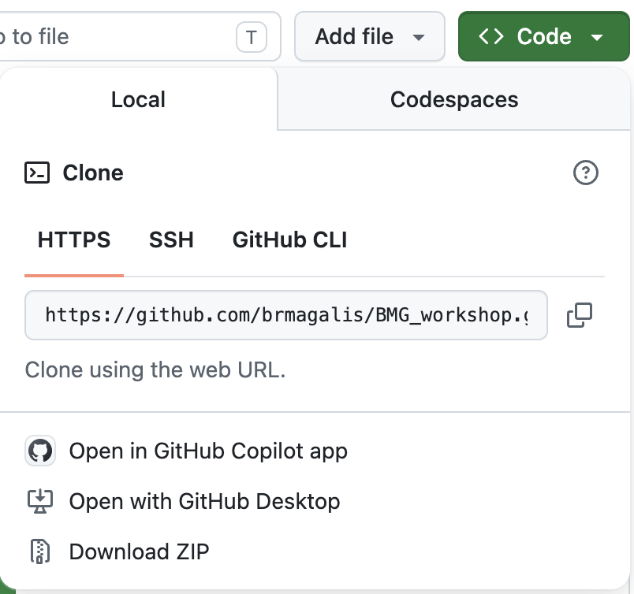
<p>Figure 1. How to download an entire Github repository as a compressed object.</p>
</div>

<br>
### Step 2. Move this zip file to an easy-to-access location (e.g., Desktop) and de-compress ("unzip").

You should now see a folder entitled,```BMG_workshop-main```. Enter this folder and unzip also the object entitled, ```data.zip```.

<br>
### Step 3. Ensure sequences are aligned properly.
Genetic/genomic data is often stored in a FASTA format, which looks like below if you were to open it in a text-editing tool (e.g., BBEdit or Notepad++):

<div style="text-align:center;">
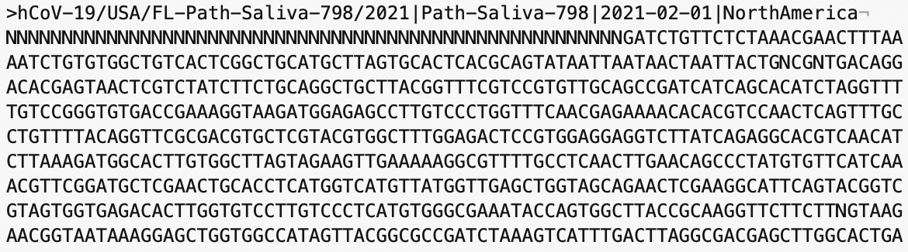
<p>Figure 2. FASTA file when viewed in text-editing tool BBEdit.</p>
</div>


SARS-CoV-2 sequences must be aligned in order to be certain that identified changes at individual sites are the result of mutation and not error. While we are not covering multiple sequence alignments today, we can still take a look at the already aligned sequences to look for anything unexpected. You can open the ```tardis.aln``` file in the "data" folder in the tool Aliview, which should look similar to the following where each nucleotide is given a distinct color for easy visualization:

<div style="text-align:center;">
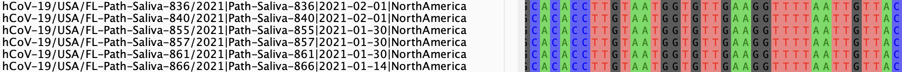
<p>Figure 3. FASTA file when viewed in Aliview.</p>
</div>

####<p style="color: red;">Does your alignmnent file truly look aligned? </p>

<p>If not, try to see if you can properly move sequences around (HINT: try using the <kbd class="kbc-button">space</kbd> bar.</p>  

Now save this alignment as ```tardis_corrected.aln```.

<br>
### Step 4. In Aliview, scroll over to nucleotide position 23063.
This is your mutation of interest!


<br>
### Step 5. To see if this mutation is non-synonymous, or results in an amino acid change, click on the icon at the top left that stands for "Translate nucleotide sequence to Amino Acids."
This icon should appear as follows:

<div style="text-align:center;">

<p>Figure 4. Icon for translating nucleotides to amino acids in Aliview.</p>
</div>

This will color nucleotides according to codon. Unfortunately, this part of the alignment is in the wrong reading frame. 

<br>
### Step 6. To change the frame, toggle the "Reading frame" option at the top. 
We just so happen to know that we need to switch to Frame 3 in this region, but if you're ever uncertain, the easiest thing to look for is the presence of stop codons (for protein-coding sequences). You should now see codons colored similarly to the following:

<div style="text-align:center;">
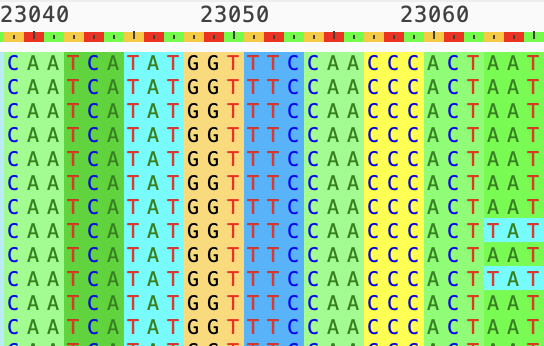
<p>Figure 5. Codon color-coding in Aliview.</p>
</div>

<br>
### Step 7. Visualize the change at the amino acid level.
Now click on the icon for  "Show translation as only one character amino acid" at the top, which looks like the following: 

<div style="text-align:center;">
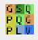
<p>Figure 6. Icon for amino acid translation in Aliview.</p>
</div>

You should now see your amino acid change, as follows:

<div style="text-align:center;">
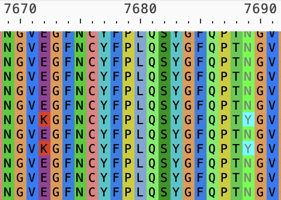
<p>Figure 7. N501Y mutation visualized in Aliview.</p>
</div>

Now remember, these are whole genomes, so the amino acid numbering (7689) is different from the Spike protein (501).


<br>
<a name="Phylogeny"></a>
### Part2. Reconstruct a phylogenetic tree

### Step 8. Build the tree
Open your terminal or command prompt and first change directories (```cd```) so that you are within the folder containing the alignment. For example, I would type:

```
cd ~/Desktop/BMG_workshop-main/data
```

When you downloaded IQ-TREE, the executable was installed, but in order to run it you will have to add the path to this executable to what is known as your PATH variable. To see what paths are currently in your path variable, you can type:

```
echo $PATH 
```

For example, my IQ-TREE executable is located in ```/Applications/iqtree-3.0.0-macOS/bin```. To add this path to my PATH variable, I would type as below. **It is imperative that you type everything else as is because you do not want to replace existing locations in your PATH variable.**

```
export PATH="/Applications/iqtree-3.0.0-macOS/bin:$PATH"
```
To see all of the commands and arguments available in IQ-TREE, you can type ```iqtree3 -h```.

To begin a fast tree search for your corrected alignment, type the following:

```
iqtree3 -s tardis_corrected.aln --fast --model GTR+F+I+G4
```

This command specifies the use of an evolutionary model (GTR+F+I+G4) for a fast search for the maximum likelihood tree. **Though we will not discuss evolutionary models or tree reconstruction methods, it is important to remember that what you choose here is highly data-dependent and should not be used as one-size-fits-all criteria in phylogenetics.**

You should now see a log printing to your screen, as well as to a ```.log``` file within the folder. Additional files with run information will also be generated, which we will not discuss today.

<br>
### Step 9. Map mutations and patient metadata to tree
Once you see that the ```.treefile``` has been generated in your data folder, open your terminal or command prompt again and run the Rscript in the main (```../```) folder using the following command:


```
Rscript ../SC2_N501Y.R
```

Assuming you have the correctly named tree file and alignment, this R code will automatically generate the file ```tree_plot.png``` in your data folder, which should look like below:

<div style="text-align:center;">
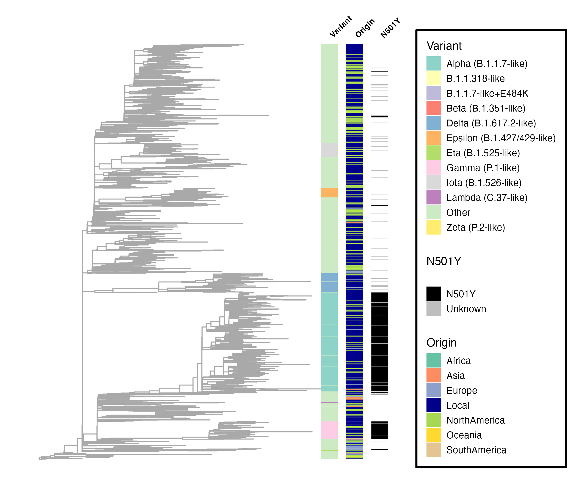
<p>Figure 8. Tree with branches annotated according to WHO variant classification, geographical sampling origin, and N501Y mutation classification.</p>
</div>

In this tree, external branches, or leaves, represent sequences from your alignment, with relationships represented by internal branches. The sampling origin and variant information are provided in the ```tardis_metadata.csv``` file, whereas the N501Y mutation annotation is assigned in the R code using the alignment in your folder.


####<p style="color: red;">What can you say about the emergence of the N501Y mutation? </p>

<br>
<a name="PDB"></a>
## Part 3. Visualize the mutation in the protein structure


### Step 10. Download the crystal structure from the Protein Data Bank, or PDB.
We will be downloading the file containing the crystal structure ```6M0J``` from the (PDB website)[https://www.rcsb.org/], which I encourage you to explore. The 6M0J structure is highly cited, as it was one of the first deposited during the pandemic and depicts the interaction between the Spike receptor-binding domain (RBD) and its target - ACE2 - at 2.45 Angstrom resolution. You can find related information to this structure by searching for the structure within the PDB, as follows:

<div style="text-align:center;">
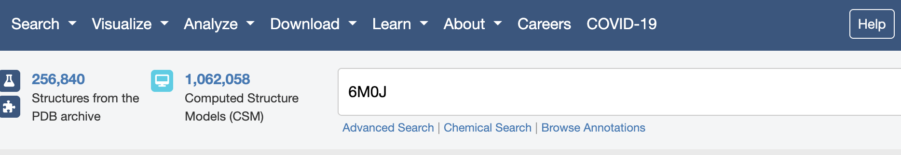
<p>Figure 9. Searching the PDB for the original crystal structure of the SARS-CoV-2 spike protein.</p>
</div>


<br>
### Step 11. Fetch your PDB file in PyMol
Open the PyMol viewing window. You can type commands directly in the bottom terminal, which is what we are going to do today. There should already be a blinking cursor ready for commands.

In your PyMol terminal, first change directories so that you are in your main folder. For me, that would be


```
cd ~/Desktop/BMG_workshop-main

```

Next, fetch the PDB file directory from the PDB database:

```
fetch 6M0J
```

Your PyMol viewing window should now show both bound structures as the same color, as below:

<div style="text-align:center;">
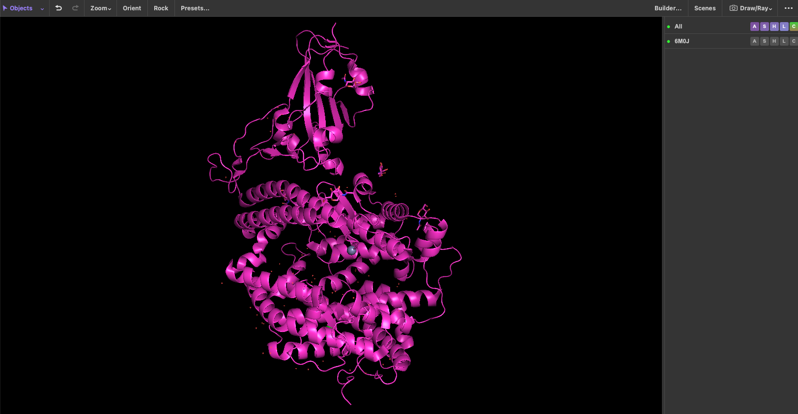
<p>Figure 10. PyMol fetch function applied to PDB structure 6M0J.</p>
</div>

<br>
### Step 12. Assign distinct colors to different PDB proteins
In this PDB, each protein is designated as a different "chain" (see PDB website for more information). Chain A refers to ACE2 and chain E to Spike. Type the following into your PyMol terminal to assign distinct colors for easier visualization:

```
color salmon, chain A
color lightblue, chain E
```

Now fetch the amino acid sequences for Spike and ACE2 separately by typing the following in your PyMol terminal. Note you can also do this from the beginning instead of fetching the bound structures.

```
fetch 6M0J_E
fetch 6M0J_A

```

<br>
### Step 13. Display amino acid sequences in PyMol
Now click on the Display option at the top of your screen, and select "Sequence":

<div style="text-align:center;">

<p>Figure 11. Displaying an amino acid sequence in PyMol.</p>
</div>

Let's first make sure residue 501 in the sequence is an Asparagine (N). Scroll through the sequence using the scroll bar until you get to position 501, which sits right atop an "N":

<div style="text-align:center;">
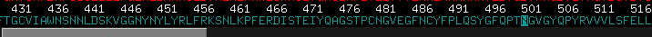
<p>Figure 12. Displaying an amino acid sequence in PyMol.</p>
</div>


<br>
### Step 14. Highlight specific residues of interest.

Type the following in your PyMol terminal, which should highlight residue ("resi") 501 in Spike and show side chains for 501 in "stick" form:

```
select N501Y, resi 501 and chain E
show sticks, N501Y
```

You can also color this residue differently using the following:

```
color blue, N501Y
```

Zooming can be tricky in PyMol, so one trick to zoom in on specific residues is to use the zoom function in the terminal with a specified cutoff in number of Angstroms. Let's zoom in on residue 501 and view all potential interactions within 5 Angstroms:

```
zoom N501Y, 5
```


####<p style="color: red;">What do you think? Are there potential interactions that might be impacted by a mutation at this site? </p>


<br>
### Step 15. Look for potential interacting residues.

Now visualize all individual residue side chains as "sticks" in the ACE2 structure to gain better insight into potential interactions:

```
show sticks, chain A
```

**Note:** At any time, if you don't like what you've done you can type ```undo``` into the terminal. 

Now select individual residues that you believe might interact with residue 501 or be impacted by a change at this site. You can do this by selecting on the cartoon residue within the viewer window. You can then see what residue number this selection corresponds to by looking for the highlighted residue in the sequence above. For example, for sites Y41 and K353:

```
select put_int, resi 41+353 and chain A
select red, put_int
```

You can also see the distances between residues using the distance command. For this, you will have to have the specific residue numbers (instead of assigned names):

```
distance put_int_dist, resi 41+353 and chain A, resi 501 and chain E
```

Yikes! This looks a bit messy, so let's set a cutoff of 4 Angstroms after deleting the previous distances:

```
delete put_int_dist
distance put_int_dist, resi 41+353 and chain A, resi 501 and chain E, 4
```

Now let's export, or "ray", a high-quality image of your resulting interactions. For common image choices, see [CompChems(https://www.compchems.com/how-to-make-publication-quality-images-with-pymol/)

```
bg_color white
ray 2400,2400
png interactions_501.png, dpi=300, width=13.2cm
```

Your figure should look something like this:

<div style="text-align:center;">
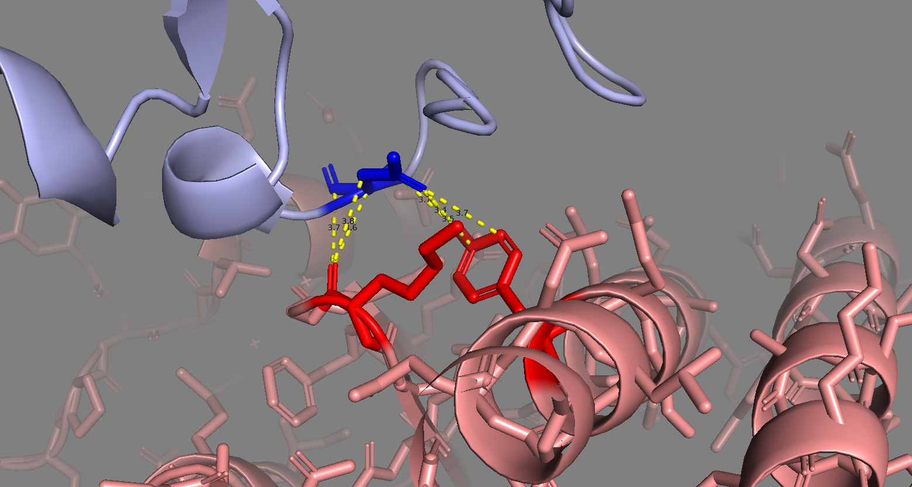
<p>Figure 13. Example exported figure from PyMol demonstrating putative interactions (within 4 Angstroms) between Spike residue 501 and ACE2.</p>
</div>


### Congratulations! You have successfully gathered computational data to support further testing of the role of this mutation in infectivity and transmission. What's next?
 
